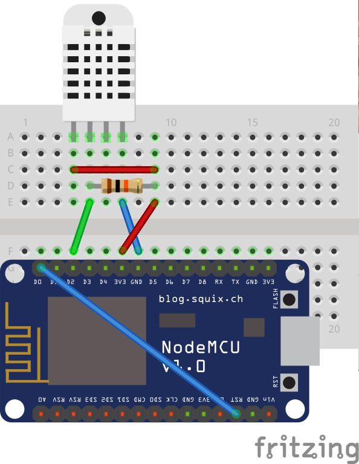

# Temperature MQTT Sensor
[](https://travis-ci.org/nolte/platformio-mqtt-dht)  

Publish the DHT Information all minute to a central MQTT topic `/iot/dht`, after than the NodeMCU go in the DeepSleep mode.

```json
{"humidity":32.20,"temperature":24.20,"heat_index":23.52,"device_id":"dht-livingroom","pin":2}
```


## Dependencies

 - [MQTT Client](http://platformio.org/lib/show/89/PubSubClient)
 - [Arduino Json](http://platformio.org/lib/show/64/ArduinoJson)
 - [MQTT Device Alive](http://platformio.org/lib/show/365/MQTT%20Device%20Alive)

## Schaltung



## Build Parameter

 The different Hardware combinations can be controlled with build parameters from the `platformio.ini`.


### Common Parameters

| Parameter                                | Description                               |
|------------------------------------------|-------------------------------------------|
| -DDEBUG                                  | Enable the serial out debug statements.   |
| -DDHTPIN=2                               | The Analog input pin from the DHT Sensor. |
| -DDHTTYPE=DHT11                          | The DHT Type (DHT22 or DHT11)             |
| -DUPDATEINTERVALL=30                     | The Message publishing intervall.         |
| '-DMQTT_DEVICE_ID="dht-livingroom-node"' | The MQTT Device Id (must unique)          |
| '-DMQTT_HOST="maxchen"'                  | The Hostname from the MQTT Broker         |

### NodeMCU Parameters

| Parameter                             | Description                            |
|---------------------------------------|----------------------------------------|
| '-DWLAN_SSID="{{WLANSSID}}"'          | Your WLAN SSID                         |
| '-DWLAN_PASSWORD="{{WLAN PASSWORD}}"' | Your WLAN Password                     |
| -DESPSLEEP                            | Enable the `ESP Deep Sleep` function.  |
| -DWIFI                                | Enable the `WiFi` function.            |

### Arduino Parameters

| Parameter | Description                                    |
|-----------|------------------------------------------------|
| -DETH     | Enable the `Ethernet Network Shield` function. |

## Hardware


### NodeMCU Setup
 - [NodeMCU](http://nodemcu.com/index_en.html) Deleloper Board 
 - DHT22
 - 10kΩ
 
### ArduinoNetwork Setup
 - [Arduino Uno](https://www.arduino.cc/en/Main/ArduinoBoardUno)
 - [Ethernet Shield](https://www.arduino.cc/en/Main/ArduinoEthernetShield)
 - DHT22
 - 10kΩ
 
# Libs
 - [DHT Sensor Library](http://platformio.org/lib/show/19/DHT%20sensor%20library)
 - [Arduino Json](http://platformio.org/lib/show/64/ArduinoJson)   
 - [MQTT PubSubClient](http://platformio.org/lib/show/89/PubSubClient)
 - [MQTT AliveMessage](http://platformio.org/lib/show/365/MQTT%20Device%20Alive) 
 
